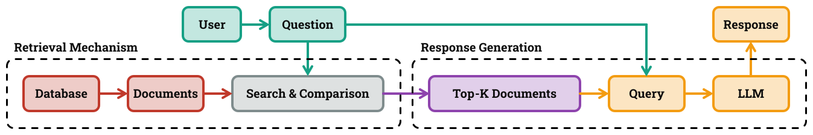
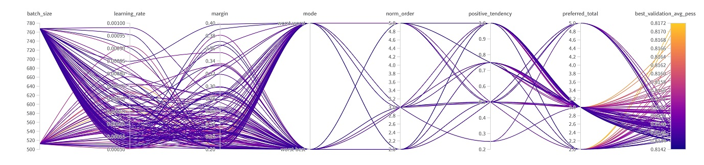

# Improving Retrieval Performance in Retrieval-Augmented Generation Architecture

## Overview
This research explores the interplay between syntactic and semantic search methods for document retrieval in the **Retrieval-Augmented Generation (RAG)** architecture. As illustrated in the following figure, A RAG system comprises a pipeline where the question is processed through a **Retrieval Mechanism** to identify the most relevant documents stored in a database. These documents are then aggregated with the question to construct an enhanced query, which is subsequently fed into a **Large Language Model (LLM)** for Response Generation. While the RAG architecture was originally designed to help LLMs generate more informed responses, but the retrieval mechanism serves as a primary role in such architecture, as the quality of the final response depends heavily on the relevance of the retrieved documents.


<p align="justify">
In this project, we first investigate different **baseline retrieval mechanisms** such as syntactic search through textual entities and semantic search with embedding models. Then, focusing on the latter, we **propose a novel learnable mapping** that optimizes question embeddings by aligning them with relevant document clusters via contrastive learning. We also introduce **a new metric for evaluating retrieval performance**. Our results demonstrate that the proposed method has a good potential to improve semantic search across various metrics, including our novel metric. For more details, please refer to [the last presentation](./checkpoints/checkpoint_03.pdf) or the [the report](./report/t3p9_report.pdf) prepared for this project.
</p>

### Project Stakeholder

The primary stakeholder is **LINKS Foundation**, which seeks to leverage advanced RAG systems for European projects and other applications. The project was supervised by Professor Giuseppe Rizzo and Dr. Lorenzo Bongiovanni.

### Project Developers

The project was developed by [Homayoun Afshari](https://www.linkedin.com/in/homayoun-afshari/), [Hossein Khodadadi](https://hossenkhodadadi.github.io/), and [Arash Daneshvar](https://www.linkedin.com/in/arash-daneshvar/).

## Project Structure
```bash
ADSP Project/
├── datasets/                       # Directory of the datasets
├── notebooks/                      # Directory of the notebooks
│   └── stable_system.ipynb         # Main script to create retrieval mechanisms
│   └── stable_data_cleaning.ipynb  # Main script to perform data cleaning
├── checkpoints/                    # Directory of the checkpoint presentations
└── report/                         # Directory of the report
```

## Wandb Hyperparameter Tuning
As demonstrated in the following figure, we have performed Bayesian hyperparameter tuning to optimize the proposed method discussed in this project. More details and complete diagram are available in [this link](https://wandb.ai/adsp-gt3-o1/ms-marco/reports/ADSP-gt3--VmlldzoxMTA3OTExOQ?accessToken=3qt191ygaowfk12zgme3665lczudi0bbim9pxfko5qoz01gaeu4fxvunz9fomiuu).



---
## Installation
To run this project, you need to install the packages available in the stable_system notebook. You can install it via pip:<br/>
```bash
pip install wandb
pip install datasets
pip install sentence_transformers
pip install faiss-cpu
pip install faiss-gpu
pip install scann
pip install rapidfuzz
pip install python-Levenshtein
pip install rank-bm25
pip install spacy
python -m spacy download en_core_web_sm
```

## Usage
First, you need to create a directory in your google drive with the following address as you need to mount it later, `ADSP Project/datasets`, copy the content from the same directory in our repository and paste it into your `ADSP Project/datasets`. Now feel free to run the `stable_system.ipynb`.

Second, if you would like to execute the process of data preprocessing to recreate the `ADSP Project/datasets` files, you need to run the `stable_data_cleaning.ipynb`, remember to provide the proper [Qroq API ](https://groq.com/) from your account to the corresponding notebook. You can use the following hyperparameter arguments to customize the training process:

- `--epoch`: Number of epochs for training (default is 50).
- `--batch_size`: Batch size for training (default is 512).
- `--learning_rate`: Learning rate (default is 0.0001).
- `--margin`: The margin which separates the positive and negative samples.
- `--mode`: Policy for choosing the positive and negative samples.
- `--norm_order`: Normalization order.
- `--positive_tendency`: The tendency to choose positive samples over negative samples.
- `--preferred_total`: Total number of positive/negative chosen samples for contrastive loss.


## Objectives

1. Enhance the **retrieval process** by incorporating advanced chunk processing, including:
   - Summarization
   - Topic extraction
   - Key entity identification
2. Optimize **query expansion** to:
   - Identify relevant topics and entities
   - Differentiate instructions from user queries
   - Handle multiple questions effectively

---

## Data
<!---
We use the **MS MARCO dataset (Microsoft Machine Reading Comprehension)**, a large-scale, open-source dataset for passage ranking and question answering. The dataset includes:
- **Triplets**: Query, passage, relevance score
- Tasks:
  - **Passage Retrieval**: Evaluate retrieval quality
  - **Question Answering**: Derive answers using passages 
--->

We use the MS MARCO dataset (Microsoft Machine Reading Comprehension) and TriviaQA, two large-scale, open-source datasets for passage ranking and question answering. The datasets include:

- **MS MARCO**:
Triplets: Query, passage, relevance score  

  Tasks:
   - Passage Retrieval: Evaluate retrieval quality
   - Question Answering: Derive answers using passages
---

## Workflow

### Project Phases
1. **Design and Management**:
   - Understand project requirements
   - Develop initial designs
   - Create presentations and engage with the mentor
2. **Development**:
   - Research resources
   - Build baseline models
   - Incorporate advanced retrieval techniques
3. **Dry Run**:
   - Restructure the database
   - Experiment with ideas
   - Produce an MVP (Minimum Viable Product)
4. **Final Presentation and Evaluation**:
   - Compile findings
   - Develop the final product
   - Deliver project presentations and take exams

### Tools and Techniques
- **Natural Language Processing (NLP)** techniques such as Named Entity Recognition (NER) and summarization
- **Scoring mechanisms** to improve retrieval accuracy

---

## Mentorship

The project is supported by **Lorenzo Bongiovanni** from LINKS Foundation. Guidance is provided through **biweekly mentoring calls**.

---

## Contribution

This repository is a collaborative space for:
- **Code development**
- **Documentation**
- **Presentations**

---

## Policy

- The repository is **public**, following an open-design principle unless otherwise requested by the organization.
- Contributions must align with the objectives and follow the established guidelines.
