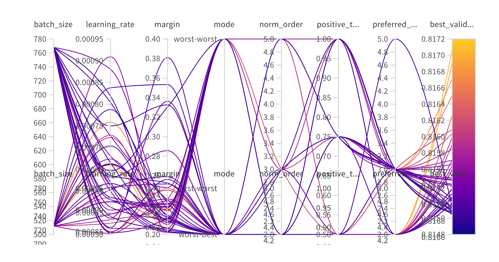

# Improving Retrieval Performance in Retrieval-Augmented Generation Architecture

## Overview

This project focuses on enhancing the **Retrieval-Augmented Generation (RAG)** system to improve the quality of responses generated by large language models (LLMs). RAG combines a **retrieval** process (selecting relevant content from a database) and **generation** (producing context-aware answers using an LLM). Our goal is to refine the **retrieval component**, optimizing the context provided to the LLM and thus elevating the response quality.

### Project Stakeholder

The primary stakeholder is **LINKS Foundation**, which seeks to leverage advanced RAG systems for European projects and other applications. The project was supervised by Professor Giuseppe Rizzo and Dr. Lorenzo Bongiovanni.

### Project Developers

The project was developed by [Homayoun Afshari](https://www.linkedin.com/in/homayoun-afshari/) (308563), [Hossein Khodadadi](https://hossenkhodadadi.github.io/) (313884), and [Arash Daneshvar](https://www.linkedin.com/in/arash-daneshvar/) (314415).

---
## Project Structure
```bash
ADSP Project/
├── datasets/           # Directory containing the datasets
├── notebooks/            # The notebooks
│   └── stable_system.ipynb    # Main script to create the retrieval system
│   └── stable_data_cleaning.ipynb    # Main script to perform the data cleaning
└── report      
```
## Installation
To run this project, you need to install the packages available in the stable_system notebook. You can install it via pip:<br/>
```bash
pip install wandb
pip install datasets
pip install sentence_transformers
pip install faiss-cpu
pip install faiss-gpu
pip install scann
pip install rapidfuzz
pip install python-Levenshtein
pip install rank-bm25
pip install spacy
python -m spacy download en_core_web_sm
```

## Usage
Once you have installed the required libraries and cloned the dataset repository, you need to  simply run the stable_system.ipynb,  you can use the following hyperparameter arguments to customize the training process:

- `--epoch`: Number of epochs for training (default is 50).
- `--batch_size`: Batch size for training (default is 512).
- `--learning_rate`: Learning rate (default is 0.0001).
- `--margin`: The margin which separates the positive and negative samples.
- `--mode`: Policy for choosing the positive and negative samples.
- `--norm_order`: Normalization order.
- `--positive_tendency`: The tendency to choose positive samples over negative samples.
- `--preferred_total`: Total number of positive/negative chosen samples for contrastive loss.

Note: You can omit any arguments to use their default values.

## Wandb Hyperparameter Tuning 

As demonstrated in the Figure we have performed Bayesian hyperparameter tuning to optimize the arguments. The complete diagram is available at the following [link](https://wandb.ai/adsp-gt3-o1/ms-marco/reports/-25-01-25-00-01-37---VmlldzoxMTA3ODgzNg).



## Objectives

1. Enhance the **retrieval process** by incorporating advanced chunk processing, including:
   - Summarization
   - Topic extraction
   - Key entity identification
2. Optimize **query expansion** to:
   - Identify relevant topics and entities
   - Differentiate instructions from user queries
   - Handle multiple questions effectively

---

## Data
<!---
We use the **MS MARCO dataset (Microsoft Machine Reading Comprehension)**, a large-scale, open-source dataset for passage ranking and question answering. The dataset includes:
- **Triplets**: Query, passage, relevance score
- Tasks:
  - **Passage Retrieval**: Evaluate retrieval quality
  - **Question Answering**: Derive answers using passages 
--->

We use the MS MARCO dataset (Microsoft Machine Reading Comprehension) and TriviaQA, two large-scale, open-source datasets for passage ranking and question answering. The datasets include:

- **MS MARCO**:
Triplets: Query, passage, relevance score  

  Tasks:
   - Passage Retrieval: Evaluate retrieval quality
   - Question Answering: Derive answers using passages
---

## Workflow

### Project Phases
1. **Design and Management**:
   - Understand project requirements
   - Develop initial designs
   - Create presentations and engage with the mentor
2. **Development**:
   - Research resources
   - Build baseline models
   - Incorporate advanced retrieval techniques
3. **Dry Run**:
   - Restructure the database
   - Experiment with ideas
   - Produce an MVP (Minimum Viable Product)
4. **Final Presentation and Evaluation**:
   - Compile findings
   - Develop the final product
   - Deliver project presentations and take exams

### Tools and Techniques
- **Natural Language Processing (NLP)** techniques such as Named Entity Recognition (NER) and summarization
- **Scoring mechanisms** to improve retrieval accuracy

---

## Mentorship

The project is supported by **Lorenzo Bongiovanni** from LINKS Foundation. Guidance is provided through **biweekly mentoring calls**.

---

## Contribution

This repository is a collaborative space for:
- **Code development**
- **Documentation**
- **Presentations**

---

## Policy

- The repository is **public**, following an open-design principle unless otherwise requested by the organization.
- Contributions must align with the objectives and follow the established guidelines.
