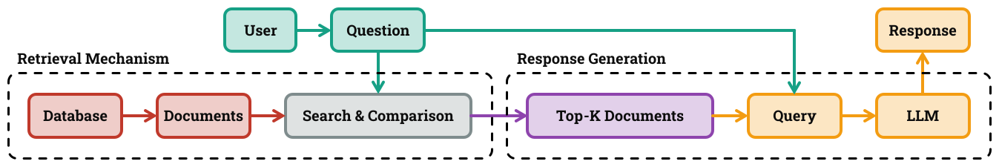

# Improving Retrieval Performance in Retrieval-Augmented Generation Architecture

## Overview
<p align="justify">
  
  <p>This research explores the world of Retrieval-Augmented Generation (RAG) by studying the interplay between syntactic and semantic search for document retrieval. As depicted in the figure below, a RAG system operates as a powerful pipeline. First, a sophisticated <strong>Retrieval Mechanism</strong> searches through a vast database and pinpoints the most relevant documents related to the input question. These carefully selected documents are then combined with the original question to form an enriched query, which is subsequently fed into a Large Language Model (LLM) for <strong>Response Generation</strong>.</p>

  <p>While RAG is essentially revolutionizing how LLMs generate informed responses, the retrieval mechanism remains the keystone, as the quality of the final answer relies critically on the relevance of the retrieved documents. Garbage in, garbage out, as they say! Therefore, this research tries to answer two fundamental questions:</p>

  <ul>
    <li><strong>How can we retreive reliably?</strong></li>
    <li><strong>How can we evaluate that reliability?</strong></li>
  </ul>
</p>



<p align="justify">
  <p>To address the first question, we explore a range of <strong>baseline retrieval mechanisms</strong>, from traditional syntactic search using textual entities to state-of-the-art semantic search based on powerful embedding models. We then focus particularly on semantic search and introduce a <strong>novel learnable mapping</strong> that optimizes question embedding. This approach aligns these embeddings with relevant document clusters through <strong>contrastive learning</strong>, which, in return, enhances the reliability of information retrieval.</p>
  
  <p>Regarding the second question, we formally define the problem of the information retrieval and investigate current performance metrics. In addition, we also introduce a <strong>new metric for evaluating retrieval performance</strong>. This metric provides a more nuanced and comprehensive assessment of the retrieval in comparison to other metrics. All together, we use these metrics to evaluate the reliability if the retrieval machanism.</p>
  
  <p>Our results demonstrate the potential of our proposed method to improve semantic search across all the investigated metrics, including our novel metric. For a comprehensive understanding of the technical details, we invite you to explore <a href="./presentations/exam.pdf">the exam presentation</a> and the <a href="./report/t3p9_report.pdf">the project report</a>.</p>

  <p>It is worth noting that we leveraged the capabilities of <a href="https://wandb.ai/">Weights & Biases</a> for Bayesian hyperparameter optimization to fine-tune our proposed method during this project. A summary of our key findings is presented in the figure below, with a complete and interactive visualization available in <a href="https://wandb.ai/adsp-gt3-o1/ms-marco/reports/ADSP-gt3--VmlldzoxMTA3OTExOQ?accessToken=3qt191ygaowfk12zgme3665lczudi0bbim9pxfko5qoz01gaeu4fxvunz9fomiuu">this interactive report</a>.</p>

</p>


### Project Structure
```bash
2024-P9-RAG-MARCO/
├── datasets/                             # Directory of the cleaned datasets
│   └── hotpot-qa-no-augmentation.pickle  # 1000 non-augmented queries from Hotpot-QA dataset
│   └── hotpot-qa-spacy-llama8b.pickle    # 100 augmented queries from Hotpot-QA dataset
│   └── ms-marco-no-augmentation.pickle   # 1000 non-augmented queries of MS-Marco dataset
│   └── ms-marco-spacy-llama8b.pickle     # 100 augmented queries from MS-Marco dataset
├── demo/                                 # Directory of the files used for demo
│   └── favicon.ico                       # Icon
│   └── index.html                        # Main HTML homepage
│   └── scripts.js                        # Front-End scripts in Vanilla JS
│   └── styles.css                        # Front-End styles in CSS
├── extras/                               # Directory of the extra files used in the readme
├── notebooks/                            # Directory of the notebooks
│   └── stable_system.ipynb               # Notebook used to implement the system
│   └── stable_data_cleaning.ipynb        # Notebook used to perform data cleaning
│   └── stable_webapp.ipynb               # Notebook used to host a webserver on Calab
├── presentations/                        # Directory of the presentations
│   └── checkpoint_01.pdf                 # Presentation on the first checkpoint
│   └── checkpoint_02.pdf                 # Presentation on the second checkpoint
│   └── checkpoint_03.pdf                 # Presentation on the third checkpoint
│   └── exam.pdf                          # Presentation on the exam day
└─── report/                              # Directory of the report
    └── t3p9_report.pdf                   # The report
```

### Project Stakeholder
<p align="justify">

  <p>The primary stakeholder of this project is <a href="https://linksfoundation.com/en/">LINKS Foundation</a> that operates in the field of digital transformation with applied research, innovation, and technology transfer activities. This work was conducted at <a href="https://www.polito.it/en">Politecnico di Torino</a> for the course <strong>Applied Data Science Project</strong> under the supervision of <a href="https://www.polito.it/personale?p=015390">Professor Giuseppe Rizzo</a>, with light mentoring provided by <a href="https://it.linkedin.com/in/lorenzo-bongiovanni-32b3b7112">Dr. Lorenzo Bongiovanni</a>.</p>

  <p>The project was developed by <a href="https://github.com/homayoun-afshari">Homayoun Afshari</a>, <a href="https://github.com/HOSSENkhodadadi">Hossein Khodadadi</a>, and <a href="https://github.com/ArashDaneshvar">Arash Daneshvar</a>.</p>

</p>

---
## Installation

### General Requirements
<p align="justify">
  
  <p>Since the main environment used for this project is Google Colab, you need to ensure that your Google Drive is set up correctly. For this purpose, create a folder named <code>ADSP Project</code> at the root of your Google Drive. Inside this folder, create another folder named <code>datasets</code>. Then, copy the contents of the <code>datasets</code> folder from the repository into this newly created folder on your Google Drive. The next step is to run the notebooks. We tried to design each one with an explanatory structure to minimize ambiguity.</p>

  <p>This project relies on various dependencies for different components, including system execution, data cleaning, and web application hosting. The table below summarizes the required packages and their usage across the different notebooks.</p>

</p>

<table>
  <tr>
    <th>Dependency</th>
    <th>Description</th>
    <th><a href="./notebooks/stable_system.ipynb">stable_system.ipynb</a></th>
    <th><a href="./notebooks/stable_data_cleaning.ipynb">stable_data_cleaning.ipynb</a></th>
    <th><a href="./notebooks/stable_webapp.ipynb">stable_webapp.ipynb</a></th>
  </tr>
  <tr>
    <td>datasets</td>
    <td>Library for loading and processing datasets</td>
    <td>✅</td>
    <td>✅</td>
    <td>✅</td>
  </tr>
  <tr>
    <td>sentence_transformers</td>
    <td>Framework for computing dense vector representations</td>
    <td>✅</td>
    <td>❌</td>
    <td>✅</td>
  </tr>
  <tr>
    <td>faiss-cpu</td>
    <td>Library for efficient similarity search</td>
    <td>✅</td>
    <td>❌</td>
    <td>✅</td>
  </tr>
  <tr>
    <td>faiss-gpu</td>
    <td>GPU-accelerated version of FAISS</td>
    <td>✅</td>
    <td>❌</td>
    <td>✅</td>
  </tr>
  <tr>
    <td>scann</td>
    <td>Scalable nearest neighbor search</td>
    <td>✅</td>
    <td>❌</td>
    <td>✅</td>
  </tr>
  <tr>
    <td>rapidfuzz</td>
    <td>Fuzzy string matching library</td>
    <td>✅</td>
    <td>❌</td>
    <td>❌</td>
  </tr>
  <tr>
    <td>python-Levenshtein</td>
    <td>Levenshtein distance computation</td>
    <td>✅</td>
    <td>❌</td>
    <td>❌</td>
  </tr>
  <tr>
    <td>rank-bm25</td>
    <td>BM25 ranking algorithm for information retrieval</td>
    <td>✅</td>
    <td>❌</td>
    <td>❌</td>
  </tr>
  <tr>
    <td>spacy</td>
    <td>NLP processing library</td>
    <td>✅</td>
    <td>✅</td>
    <td>❌</td>
  </tr>
  <tr>
    <td>en_core_web_sm</td>
    <td>Pre-trained SpaCy model for English NLP</td>
    <td>✅</td>
    <td>✅</td>
    <td>❌</td>
  </tr>
  <tr>
    <td>groq</td>
    <td>API client for Groq models</td>
    <td>❌</td>
    <td>✅</td>
    <td>✅</td>
  </tr>
  <tr>
    <td>fastapi</td>
    <td>Web framework for building APIs</td>
    <td>❌</td>
    <td>❌</td>
    <td>✅</td>
  </tr>
  <tr>
    <td>python-multipart</td>
    <td>Handling multipart form data in FastAPI</td>
    <td>❌</td>
    <td>❌</td>
    <td>✅</td>
  </tr>
  <tr>
    <td>pyngrok</td>
    <td>Expose local servers to the internet via Ngrok</td>
    <td>❌</td>
    <td>❌</td>
    <td>✅</td>
  </tr>
  <tr>
    <td>uvicorn</td>
    <td>ASGI server for FastAPI applications</td>
    <td>❌</td>
    <td>❌</td>
    <td>✅</td>
  </tr>
</table>

### Running the System
<p>To run the core system, follow the steps outlined in <a href="./notebooks/stable_system.ipynb">stable_system.ipynb</a>.</p>

### Running the Data Cleaner
<p>To clean and preprocess data, execute the steps detailed in <a href="./notebooks/stable_data_cleaning.ipynb">stable_data_cleaning.ipynb</a>.</p>

### Running the Webserver
<p>To launch the web server, follow the setup guide in <a href="./notebooks/stable_webapp.ipynb">stable_webapp.ipynb</a>.</p>

---
## Workflow

### Project Phases
1. **Design and Management**:
   - Understand project requirements
   - Develop initial designs
   - Create presentations and engage with the mentor
2. **Development**:
   - Research resources
   - Build baseline models
   - Incorporate advanced retrieval techniques
3. **Dry Run**:
   - Restructure the database
   - Experiment with ideas
   - Produce an MVP (Minimum Viable Product)
4. **Final Presentation and Evaluation**:
   - Compile findings
   - Develop the final product
   - Deliver project presentations and take exams

---
## Contribution

This repository is a collaborative space for:
- **Code development**
- **Documentation**
- **Presentations**

---
## Policy

- The repository is **public**, following an open-design principle unless otherwise requested by the organization.
- Contributions must align with the objectives and follow the established guidelines.
